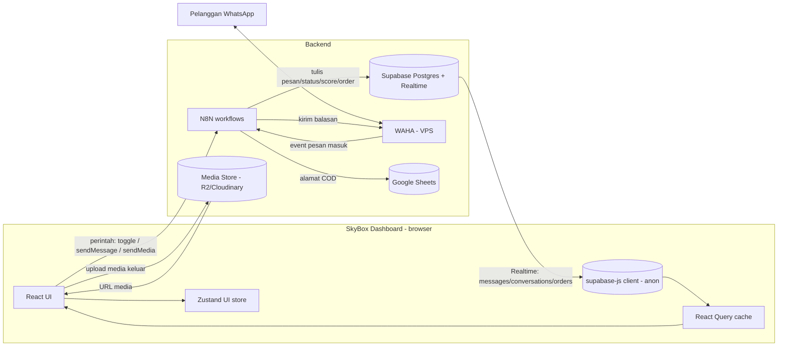

# Design Document

## Overview

Dokumen ini merancang implementasi teknis fitur **Integrasi Backend SkyBox**: menyambungkan dashboard React yang sudah ada ke backend nyata (WAHA → N8N → Supabase) menggantikan data mock, plus kemampuan balas chat (teks & media), takeover AI/Human, monitoring confidence, dan refleksi alur pembayaran TF/COD.

Prinsip desain:
- **Frontend tipis**: dashboard hanya membaca data (Supabase) dan mengirim perintah (webhook N8N). Tidak ada logika bisnis berat, tidak ada kredensial sensitif.
- **Bertahap & realistis**: untuk 1 CS, hindari over-engineering. Pasang React Query + Zustand hanya di area yang benar-benar butuh (server cache & UI state), bukan rombak total sekaligus.
- **Sumber kebenaran = Supabase**. Webhook hanya memicu aksi; hasil aktual (status, score, pesan) datang kembali lewat Supabase Realtime.

Referensi requirement ditandai sebagai `(R1)`..`(R13)` di tiap bagian.

## Architecture

### Diagram alur data



### Arah komunikasi (ringkas)
- **Dashboard → N8N** (perintah): HTTP POST ke `Webhook_Aksi` per akun. Tiga aksi awal: `toggle`, `sendMessage`, `sendMedia`. (R6, R7, R8)
- **Dashboard → Media_Store** (upload): unggah berkas keluar, dapat URL. (R8)
- **N8N → Supabase**: menulis data (di luar lingkup frontend, hanya kontrak data).
- **Supabase → Dashboard** (Realtime): perubahan `messages`, `conversations`, `orders`. (R4, R9, R10, R11, R12)

## Penambahan Dependency

| Library | Alasan | Catatan |
|---------|--------|--------|
| `@supabase/supabase-js` | Klien Supabase + Realtime | wajib |
| `@tanstack/react-query` | Cache server state (accounts/conversations/messages) | menggantikan sebagian `useState` di `App.tsx` |
| `zustand` | UI state global ringan (`activeAccountIds`, `activeView`, `activeTab`) | opsional tahap awal; boleh menyusul |

Tahap awal boleh fokus `@supabase/supabase-js` + React Query dulu; Zustand bisa diadopsi belakangan tanpa mengubah kontrak data. Keputusan ini menjaga ruang lingkup tetap kecil.

## Struktur File (baru & berubah)

```
src/
├── services/
│   ├── supabase.ts          # BARU: init client (anon), guard env (R1)
│   ├── n8n.ts               # UBAH: webhook per-aksi (toggle/sendMessage/sendMedia)
│   ├── media.ts             # BARU: abstraksi uploader media (R8)
│   └── mappers.ts           # BARU: map row DB (snake_case) ↔ tipe FE (camelCase)
├── hooks/
│   ├── useAccounts.ts       # BARU: query accounts (R3)
│   ├── useConversations.ts  # BARU: query + realtime conversations (R3,R4,R9,R10)
│   └── useMessages.ts       # BARU: query + realtime messages (R3,R4,R7)
├── types/
│   └── db.ts                # BARU: tipe baris DB + tipe domain
├── App.tsx                  # UBAH: QueryClientProvider, hapus mock, sumber data dari hooks
├── features/inbox/Inbox.tsx # UBAH: kirim teks/media, loading/error, realtime
├── features/integrations/Integrations.tsx # UBAH: 3 field webhook + threshold validasi
└── vite-env.d.ts            # UBAH: typing VITE_SUPABASE_URL & VITE_SUPABASE_ANON_KEY
```

Catatan: SQL skema disimpan sebagai artefak (mis. `supabase/schema.sql`) untuk dijalankan di Supabase; tidak dieksekusi dari frontend.

## Data Models

### Tipe domain frontend (camelCase)

```ts
export interface Account {
  id: string;            // uuid Supabase (sebelumnya number lokal)
  name: string;
  phone: string;
  color: string;
  wahaSession: string;
  toggleWebhookUrl: string;
  sendMessageWebhookUrl: string;
  sendMediaWebhookUrl: string;
  confidenceThreshold: number; // 0-100
  bankAccount: string;
}

export type Handler = 'ai' | 'human';
export type OrderStatus = 'none' | 'lead' | 'waiting_payment' | 'closing';

export interface Conversation {
  id: string;
  accountId: string;
  customerPhone: string;
  customerName: string;
  handler: Handler;
  orderStatus: OrderStatus;
  confidence: number;       // 0-100
  lastPreview: string;
  lastTime: string;
  unread: number;
}

export type MessageDirection = 'in' | 'out';
export type MessageType = 'text' | 'image' | 'document';

export interface Message {
  id: string;
  conversationId: string;
  direction: MessageDirection;
  type: MessageType;
  body: string;          // teks atau caption
  mediaUrl: string | null;
  createdAt: string;
}

export type OrderType = 'tf' | 'cod';

export interface Order {
  id: string;
  conversationId: string;
  type: OrderType;
  status: string;
  address: string | null;
  amount: number | null;
}
```

> Perubahan penting dari kode saat ini: `Account.id` & `Chat.id` menjadi **uuid string** (Supabase), dan `Chat` lama dipecah jadi `Conversation` + `Message`. `Account` lama yang punya 1 `n8nWebhookUrl` diganti tiga field webhook per-aksi.

### Skema SQL Supabase (artefak `supabase/schema.sql`)

```sql
create table accounts (
  id uuid primary key default gen_random_uuid(),
  name text not null,
  phone text not null,
  color text default '#25D366',
  waha_session text not null,
  toggle_webhook_url text default '',
  send_message_webhook_url text default '',
  send_media_webhook_url text default '',
  confidence_threshold int not null default 70 check (confidence_threshold between 0 and 100),
  bank_account text default '',
  created_at timestamptz default now()
);

create table conversations (
  id uuid primary key default gen_random_uuid(),
  account_id uuid not null references accounts(id) on delete cascade,
  customer_phone text not null,
  customer_name text default '',
  handler text not null default 'ai' check (handler in ('ai','human')),
  order_status text not null default 'none' check (order_status in ('none','lead','waiting_payment','closing')),
  confidence int not null default 100 check (confidence between 0 and 100),
  last_preview text default '',
  last_time timestamptz default now(),
  unread int not null default 0,
  updated_at timestamptz default now(),
  unique (account_id, customer_phone)
);

create table messages (
  id uuid primary key default gen_random_uuid(),
  conversation_id uuid not null references conversations(id) on delete cascade,
  direction text not null check (direction in ('in','out')),
  type text not null default 'text' check (type in ('text','image','document')),
  body text default '',
  media_url text,
  created_at timestamptz default now()
);

create table orders (
  id uuid primary key default gen_random_uuid(),
  conversation_id uuid not null references conversations(id) on delete cascade,
  type text not null check (type in ('tf','cod')),
  status text not null default 'waiting_payment',
  address text,
  amount numeric,
  created_at timestamptz default now()
);

-- Realtime
alter publication supabase_realtime add table messages, conversations, orders;

-- RLS: anon boleh BACA (R2.10, R13). Tulis dilakukan N8N via service_role (bypass RLS).
alter table accounts enable row level security;
alter table conversations enable row level security;
alter table messages enable row level security;
alter table orders enable row level security;

create policy "anon read accounts" on accounts for select to anon using (true);
create policy "anon read conversations" on conversations for select to anon using (true);
create policy "anon read messages" on messages for select to anon using (true);
create policy "anon read orders" on orders for select to anon using (true);
```

> Catatan keamanan (R13): tanpa policy `insert/update` untuk `anon`, frontend tidak bisa menulis langsung — perubahan data hanya dari N8N (service_role). Update config `accounts` dari halaman Integrations memerlukan keputusan: (a) via webhook N8N, atau (b) policy update terbatas untuk `accounts`. Lihat "Pertanyaan Terbuka".

### Mapper (snake_case ↔ camelCase) — `src/services/mappers.ts`
Fungsi murni `mapAccountRow`, `mapConversationRow`, `mapMessageRow`, `mapOrderRow` mengubah baris DB ke tipe domain. Mengisolasi penamaan kolom agar komponen tidak menyentuh snake_case. (R3)

## Components and Interfaces

### Services

#### `src/services/supabase.ts` (R1, R13)
- Membaca `import.meta.env.VITE_SUPABASE_URL` & `VITE_SUPABASE_ANON_KEY`.
- Jika salah satu kosong → lempar/expose error konfigurasi; App menampilkan layar error & menghentikan pemuatan data (R1.3).
- Export satu instance `supabase` (anon). Tidak pernah menyentuh service_role (R1.4).

### `src/services/n8n.ts` (refactor) (R6, R7, R8, R13)
Generalisasi pemanggilan webhook per-aksi, memilih URL sesuai aksi dari objek `Account`.

```ts
type N8nAction = 'toggle' | 'sendMessage' | 'sendMedia';

const WEBHOOK_FIELD: Record<N8nAction, keyof Account> = {
  toggle: 'toggleWebhookUrl',
  sendMessage: 'sendMessageWebhookUrl',
  sendMedia: 'sendMediaWebhookUrl',
};

async function callN8n(account, action, payload) {
  const url = (account[WEBHOOK_FIELD[action]] as string)?.trim();
  if (!url) throw new Error(`Webhook "${action}" untuk akun "${account.name}" belum diatur (menu Integrations).`);
  // POST { accountId, accountPhone, wahaSession, ...payload }
}
```

Kontrak payload (hanya identitas + data aksi, tanpa kredensial — R13.1):

```jsonc
// toggle (R6)
{ "accountId","accountPhone","wahaSession","conversationId","customerPhone","handler":"human" }
// sendMessage (R7)
{ "accountId","accountPhone","wahaSession","conversationId","customerPhone","text":"..." }
// sendMedia (R8)
{ "accountId","accountPhone","wahaSession","conversationId","customerPhone","mediaUrl":"https://...","mediaType":"image|document","caption":"..." }
```

### `src/services/media.ts` (R8)
Abstraksi uploader agar provider mudah diganti:

```ts
export interface MediaUploader {
  upload(file: File): Promise<{ url: string; type: 'image' | 'document' }>;
}
```
Implementasi awal `r2Uploader` / `cloudinaryUploader`. Validasi tipe berkas (hanya image & pdf) sebelum upload (R8.3). Tidak menyimpan biner ke Supabase (R8.7).

## State Management & Hooks

- **React Query** menjadi sumber server state:
  - `useAccounts()` → `accounts` (R3.1).
  - `useConversations(accountId)` → daftar conversation + langganan Realtime untuk INSERT/UPDATE (R3.2, R4, R9.5, R10).
  - `useMessages(conversationId)` → pesan terurut `created_at` + Realtime INSERT (R3.3, R4.2, R7.5).
- **Zustand** (atau tetap `useState` sementara) untuk UI: `activeAccountIds`, `activeView`, `activeTab`, `activeChatId`.
- `App.tsx` dibungkus `QueryClientProvider`. Data mock (`defaultAccounts`, `initialChatsData`) dihapus (R3.6).
- Loading/error per area memakai status React Query (`isLoading`, `isError`) → indikator & tombol retry (R3.4, R3.5).

### Realtime (R4, R10)
- Saat akun aktif ditampilkan, buka channel Supabase per `account_id` untuk tabel `conversations` & `messages` (R4.1).
- Handler event menulis ke cache React Query (`queryClient.setQueryData`) agar UI update tanpa refetch (R4.5).
- Pesan `in` untuk percakapan tak terbuka → naikkan `unread` + notifikasi (R4.3, R4.4).
- Perubahan `handler`/`order_status`/`confidence` → komponen menempatkan ulang conversation ke tab yang sesuai (sumber kebenaran = nilai DB) (R6.5, R9.5, R10, R12.3).
- Status koneksi Realtime ditampilkan; auto-reconnect bawaan supabase-js, plus indikator (R4.6).

## Perubahan Komponen UI

### Inbox (`features/inbox/Inbox.tsx`)
- Sumber data dari `useConversations`/`useMessages` (bukan props mock).
- Tab filter tetap (handler & orderStatus) namun berbasis data DB.
- **Kirim teks**: tombol kirim memanggil `callN8n(account,'sendMessage',{...})`; input divalidasi tidak kosong (R7.2); pertahankan teks bila gagal (R7.3).
- **Kirim media**: tombol attachment → pilih file → `media.upload()` (indikator proses R8.6) → `callN8n(account,'sendMedia',{...})`.
- **Tampilkan media**: bubble mendukung `type` image/document via `mediaUrl` (masuk: URL WAHA; keluar: URL Media_Store).
- Switch AI/Human: pola optimistic + rollback yang sudah ada, kini lewat `toggle` webhook (R6.2, R6.3); blok bila webhook kosong (R6.4).
- Indikator loading & error pemuatan pesan (R3.4, R3.5).
- Notifikasi pesan masuk & "butuh penanganan manusia" (R4.4, R10.2).

### Integrations (`features/integrations/Integrations.tsx`)
- Form menampilkan **tiga** field webhook: `toggleWebhookUrl`, `sendMessageWebhookUrl`, `sendMediaWebhookUrl` (R5.2).
- Validasi `confidenceThreshold` 0–100 (R5.5); tolak hapus akun terakhir (R5.6).
- Simpan menulis ke `accounts` Supabase (R5.4) — lihat Pertanyaan Terbuka soal jalur tulis.
- Struktur webhook dibuat agar mudah ditambah aksi baru tanpa ubah skema besar (R5.3) — disarankan menyimpan sebagai kolom eksplisit sekarang, dengan opsi migrasi ke kolom `jsonb webhooks` bila aksi bertambah banyak.

### Notifikasi & status koneksi
- Komponen toast/banner ringan untuk pesan masuk (R4.4), order TF masuk (R11.2), dan status Realtime (R4.6).

## Error Handling
- **Konfigurasi env hilang** → layar error global, data tidak dimuat (R1.3).
- **Webhook gagal** → toast gagal; untuk toggle lakukan rollback optimistic (R6.3); untuk teks pertahankan input (R7.3); untuk media tampilkan pesan gagal (R8.5).
- **Webhook URL kosong** → blok aksi + arahkan ke Integrations (R6.4, R7.4).
- **Upload media gagal** → tidak memanggil webhook (R8.4).
- **Realtime putus** → reconnect + indikator (R4.6).

## Correctness Properties

Properti/invariant yang harus selalu benar dan jadi dasar pengujian:

### Property 1: Read-only frontend
Dashboard tidak pernah menulis ke `messages`/`conversations`/`orders` langsung; satu-satunya jalur menulis data adalah webhook N8N.
**Validates: Requirements 13.3**

### Property 2: Tab mencerminkan DB
Penempatan conversation pada tab AI/Human ditentukan murni oleh `handler`, dan Leads/Waiting Payment/Closing oleh `order_status` dari Supabase — bukan state lokal.
**Validates: Requirements 6.5, 9.5, 10.3, 12.3**

### Property 3: Optimistic update reversibel
Setiap perubahan optimistik (toggle handler) kembali ke nilai semula bila webhook gagal.
**Validates: Requirements 6.3**

### Property 4: Payload webhook minimal
Payload webhook tidak pernah memuat kredensial WAHA atau `service_role`.
**Validates: Requirements 13.1, 13.2, 13.3**

### Property 5: Tidak ada biner di Supabase
Berkas media selalu di Media_Store/WAHA; Supabase hanya menyimpan URL/teks.
**Validates: Requirements 8.7**

### Property 6: Threshold selalu valid
`confidenceThreshold` yang tersimpan selalu berada dalam rentang 0–100.
**Validates: Requirements 5.5**

### Property 7: Minimal satu akun
Jumlah `accounts` tidak pernah menjadi nol akibat aksi hapus dari UI.
**Validates: Requirements 5.6**

### Property 8: Pemetaan warna confidence konsisten
Ring selalu biru (≥85) / kuning (70–84) / merah (<70) untuk nilai apa pun pada 0–100.
**Validates: Requirements 9.2, 9.3, 9.4**

## Testing Strategy
- **Unit**: mapper DB↔domain; pemilihan URL webhook per-aksi (`callN8n`); validasi tipe berkas & threshold; logika warna ring confidence (≥85/70–84/<70) (R9).
- **Integration (mock fetch/supabase)**: optimistic update + rollback toggle; penolakan aksi saat webhook kosong; penempatan tab berdasarkan handler/order_status dari Realtime.
- **Manual**: `npm run build` & `npm run lint` setelah perubahan; uji alur kirim teks/media end-to-end terhadap webhook N8N dummy.
- Test framework belum terpasang; bila menulis test, pasang Vitest (pilihan standar Vite) — keputusan saat fase tasks.

## Pemetaan Requirement → Desain

| Req | Ditangani oleh |
|-----|----------------|
| R1 | `services/supabase.ts`, `vite-env.d.ts`, layar error env |
| R2 | `supabase/schema.sql`, `types/db.ts` |
| R3 | `hooks/useAccounts/useConversations/useMessages`, mappers, hapus mock |
| R4 | Realtime di hooks, notifikasi, indikator koneksi |
| R5 | `Integrations.tsx` (3 webhook + validasi), tulis `accounts` |
| R6 | `n8n.ts` toggle, optimistic+rollback di Inbox |
| R7 | `n8n.ts` sendMessage, input Inbox |
| R8 | `media.ts`, `n8n.ts` sendMedia, bubble media |
| R9 | ring confidence di list (existing) baca dari DB |
| R10 | Realtime handler change → tab Human + notifikasi |
| R11 | Realtime orders tf → tab Waiting Payment + notif admin |
| R12 | Realtime orders cod → tampil alamat/status |
| R13 | anon-only client, payload webhook minimal, tanpa service_role |

## Pertanyaan Terbuka (perlu keputusan saat tasks)
1. **Jalur tulis config akun (Integrations)**: lewat webhook N8N (konsisten, aman) atau policy `update` RLS terbatas untuk `accounts`? Rekomendasi: lewat N8N agar frontend tetap read-only ke DB.
2. **Provider Media_Store**: Cloudflare R2 vs Cloudinary (memengaruhi implementasi `media.ts` & kebutuhan kredensial upload). Untuk upload dari browser, perlu mekanisme aman (signed upload / endpoint N8N) agar kunci tidak bocor.
3. **Adopsi Zustand sekarang atau nanti** (boleh ditunda; tidak memblokir).
4. **Identitas akun**: migrasi `id` number → uuid memengaruhi key React; pastikan konsisten saat mengganti mock.
