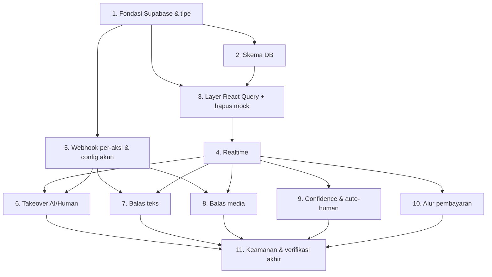

# Implementation Plan

## Overview

Rencana implementasi fitur Integrasi Backend SkyBox, dipecah inkремental: tiap langkah membangun di atas langkah sebelumnya dan diverifikasi dengan `npm run build` / `npm run lint`. Default untuk keputusan terbuka (lihat design "Pertanyaan Terbuka"): config akun ditulis lewat webhook N8N (frontend read-only ke DB), provider Media_Store via abstraksi `MediaUploader` (implementasi konkret menyusul saat kredensial tersedia). Lingkup ini tidak mencakup autentikasi multi-CS, Analytics, dan Settings.

## Task Dependency Graph



Wave definitions (tugas dalam wave sama bisa dikerjakan paralel):

```json
{
  "waves": [
    { "wave": 1, "tasks": ["1"] },
    { "wave": 2, "tasks": ["2", "5"] },
    { "wave": 3, "tasks": ["3"] },
    { "wave": 4, "tasks": ["4"] },
    { "wave": 5, "tasks": ["6", "7", "8", "9", "10"] },
    { "wave": 6, "tasks": ["11"] }
  ]
}
```

## Tasks

- [x] 1. Fondasi Supabase & tipe data
  - [x] 1.1 Pasang dependency & env
    - Install `@supabase/supabase-js` dan `@tanstack/react-query`.
    - Tambah `VITE_SUPABASE_URL` & `VITE_SUPABASE_ANON_KEY` ke `src/vite-env.d.ts` (ImportMetaEnv) dan `.env.example`. `.env` lokal terisi (anon key).
    - _Requirements: 1.1, 1.4_
  - [x] 1.2 Buat tipe data domain & baris DB di `src/types/db.ts`
    - Definisikan `Account` (id uuid string), `Conversation`, `Message`, `Order`, enum, + tipe baris DB. `App.tsx` re-export `Account`/`OrderStatus`.
    - _Requirements: 2.1, 2.2, 2.3, 2.4_
  - [x] 1.3 Buat klien Supabase `src/services/supabase.ts`
    - Klien anon + `isSupabaseConfigured` + `getSupabase()`; tanpa service_role.
    - _Requirements: 1.1, 1.2, 1.3, 1.4_
  - [x] 1.4 Buat mapper `src/services/mappers.ts`
    - `mapAccountRow`, `mapConversationRow`, `mapMessageRow`, `mapOrderRow`.
    - _Requirements: 2.1, 2.2, 2.3, 2.4_

- [x] 2. Artefak skema database
  - [x] 2.1 Tulis `supabase/schema.sql`
    - Tabel `accounts`, `conversations`, `messages`, `orders` + CHECK constraint untuk handler/order_status/direction/type.
    - Tambah tabel ke publication `supabase_realtime`.
    - Aktifkan RLS + policy SELECT untuk `anon` pada keempat tabel (tanpa policy insert/update untuk anon).
    - _Requirements: 2.1, 2.2, 2.3, 2.4, 2.5, 2.6, 2.7, 2.8, 2.9, 2.10_

- [x] 3. Layer data React Query + hapus mock
  - [x] 3.1 Bungkus `App.tsx` dengan `QueryClientProvider`
    - Provider di `main.tsx`. Layar error bila Supabase belum dikonfigurasi.
    - _Requirements: 1.3_
  - [x] 3.2 Hook `useAccounts` (query tabel `accounts`) + mutations CRUD
    - _Requirements: 3.1_
  - [x] 3.3 Hook `useConversations(accountId)` (query + realtime, loading/error/retry)
    - _Requirements: 3.2, 3.4, 3.5_
  - [x] 3.4 Hook `useMessages(conversationId)` (query urut created_at + realtime)
    - _Requirements: 3.3, 3.4, 3.5_
  - [x] 3.5 Ganti sumber data dari mock ke hooks (Inbox: Conversation/Message)
    - Hapus `defaultAccounts`, `initialChatsData`, tipe `Chat`.
    - _Requirements: 3.6_

- [x] 4. Realtime
  - [x] 4.1 Langganan Realtime `conversations` & `messages` per `account_id` (invalidate query)
    - _Requirements: 4.1, 4.2, 4.5_
  - [x] 4.2 Penghitung unread + notifikasi pesan masuk
    - Unread dari DB; notifikasi toast saat unread naik (Realtime). Store `useUiStore` + `NotificationHost`.
    - _Requirements: 4.3, 4.4_
  - [x] 4.3 Indikator status koneksi Realtime + auto-reconnect
    - Pill status (connecting/disconnected) dari callback `channel.subscribe`; supabase-js auto-reconnect.
    - _Requirements: 4.6_

- [x] 5. Webhook per-aksi & konfigurasi akun
  - [x] 5.1 Refactor `Account` jadi 3 field webhook + refactor `src/services/n8n.ts`
    - `toggleWebhookUrl`, `sendMessageWebhookUrl`, `sendMediaWebhookUrl`; `callN8n(account, action, payload)` memilih URL sesuai aksi. (`setConversationHandler`/`sendTextMessage`/`sendMedia`)
    - _Requirements: 5.2, 5.3, 6.1, 7.1, 8.2, 13.1_
  - [x] 5.2 Perbarui halaman Integrations (3 field webhook + validasi)
    - Form 3 webhook + kartu + validasi threshold 0–100 (hard-block) + tolak hapus akun terakhir. Simpan akun langsung ke Supabase `accounts` (policy RLS anon untuk accounts).
    - _Requirements: 5.1, 5.2, 5.4, 5.5, 5.6_

- [ ] 6. Takeover handler AI/Human
  - [ ] 6.1 Toggle via `toggle` webhook + optimistic update + rollback
    - Blokir aksi bila `toggleWebhookUrl` kosong dan arahkan ke Integrations.
    - _Requirements: 6.1, 6.2, 6.3, 6.4_
  - [x] 6.2 Penempatan tab AI/Human dari perubahan `handler` via Realtime
    - _Requirements: 6.5_

- [ ] 7. Balas chat teks
  - [x] 7.1 Kirim teks via `sendMessage` webhook
    - Tolak teks kosong; pertahankan input bila gagal; blokir bila URL kosong. (handler `handleSendText` di Inbox: tombol kirim + Enter)
    - _Requirements: 7.1, 7.2, 7.3, 7.4_
  - [x] 7.2 Tampilkan message keluar baru dari Realtime
    - _Requirements: 7.5_

- [x] 8. Balas chat media (gambar/PDF)
  - [x] 8.1 Baca berkas → base64 (validasi tipe image/PDF + maks 10MB + indikator upload)
    - Pendekatan base64-ke-N8N (tanpa storage frontend) sesuai preferensi biaya. N8N yang teruskan/unggah.
    - _Requirements: 8.1, 8.3, 8.6, 8.7_
  - [x] 8.2 Kirim media via `sendMedia` webhook (base64) setelah validasi
    - _Requirements: 8.2, 8.4, 8.5_
  - [x] 8.3 Render bubble media (image/document) dari `mediaUrl`
    - _Requirements: 8.1, 8.2_

- [x] 9. Monitoring confidence & auto-human
  - [x] 9.1 Ring confidence baca dari kolom `confidence`
    - _Requirements: 9.1, 9.2, 9.3, 9.4, 9.5_
  - [x] 9.2 Auto-switch ke tab Human + notifikasi via Realtime
    - Tab via Realtime + notifikasi "butuh penanganan manusia" saat handler ai→human.
    - _Requirements: 10.1, 10.2, 10.3_

- [x] 10. Refleksi alur pembayaran
  - [x] 10.1 Order TF → tab Waiting Payment + notifikasi admin + tampil `amount`
    - Tab via order_status (Realtime); notif saat order_status→waiting_payment; amount di banner header (useOrders).
    - _Requirements: 11.1, 11.2, 11.3_
  - [x] 10.2 Order COD → tampil `address` & `status`; update tab saat status berubah
    - Banner header (useOrders) + penempatan tab via order_status.
    - _Requirements: 12.1, 12.2, 12.3_

- [x] 11. Keamanan & verifikasi akhir
  - [x] 11.1 Audit payload webhook & akses Supabase
    - Payload hanya identitas + data aksi; tanpa kredensial WAHA/service_role; DB via anon + RLS (write hanya `accounts`, di-flag).
    - _Requirements: 13.1, 13.2, 13.3, 13.4_
  - [x] 11.2 Build & lint hijau + perbarui steering
    - _Requirements: 3.6_

## Notes

- Verifikasi tiap fase dengan `npm run build` & `npm run lint`. Jangan jalankan `npm run dev` lewat tool (long-running).
- Keputusan terbuka yang masih perlu input user: jalur tulis config akun (default: via N8N), provider Media_Store + cara upload aman dari browser, dan adopsi Zustand.
- Migrasi `id` number → uuid memengaruhi key React; pastikan konsisten saat mengganti mock.
- Test framework belum terpasang; bila menulis unit test, pasang Vitest lebih dulu.
